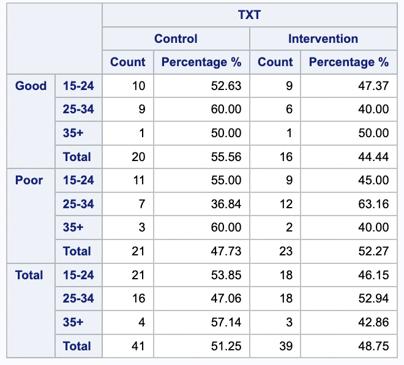

```{r setup, include=FALSE}
knitr::opts_chunk$set(echo = TRUE)
library(nlme)
library(ggplot2)
library(lattice)
library(tidyverse)
library(gee)
library(lme4)
```

# 1. Health

## (a) Evaluate the bivariate, cross-sectional relationship between randomized group assignment and participants health self-rating at the time of randomization. 

```{r input}
health <- readxl::read_excel("HW8-HEALTH.xlsx", col_names = TRUE) %>% 
  janitor::clean_names() %>%
  mutate(id = as.factor(id),
         txt = as.factor(txt),
         health = factor(health, levels = c("Poor", "Good")),
         time = factor(time, ordered = TRUE),
         agegroup = as.factor(agegroup))
head(health) # data is sorted
```
Cross-sectional table:

{#id .class width=300 height=300px}

Interpret and discuss these findings:

Equal percentage

## (b) Perform a longitudinal data analysis across all study follow-up visits

```{r longitudinal}
health.new <- subset(health, time > "1")
baseline <- rep(subset(health, time == "1"))
# make time 1 as another covariate: baseline
#113, 119, 123... only has 3 observations
add_baseline <- function(id){
  outcome = baseline$health[baseline$id == id]
  as.character(outcome)
}
health.new$baseline <- map(health.new$id, add_baseline) %>%
  factor(levels = c("Poor", "Good"))
health.new$nhealth <- as.numeric(health.new$health == "Good") # 1=good, 0=poor
health.new$postM <- (as.numeric(health.new$time)-1)*3 # month post randomization
# fit with unstructured correlation structure
health.new <- as.data.frame(health.new)
gee.health <- gee(nhealth ~ postM + txt + agegroup + baseline, data = health.new, 
                  family = "binomial", 
                  id = id,
                  corstr = "unstructured", 
                  scale.fix = FALSE) # scale parameter is phi (over dispersion)
summary(gee.health)
```


## (c) Fit a generalized linear mixed effects model with subject-specific random intercepts 

### GLMM
```{r glmm}
glmm <- glmer(nhealth  ~ postM + txt + agegroup + baseline + (1 | id), 
                  family = 'binomial', data = health.new)
summary(glmm) # pay attention to: random effects, fixed effects, 
```


### How are the interpretations different from the GEE model?


